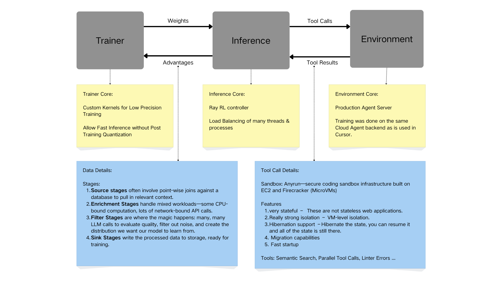

# Awesome Cursor Training Tutorial

A comprehensive guide to understanding how Cursor scales Reinforcement Learning (RL) for AI-powered code assistance.

## 👥 Authors

- [Zhan Shi](https://www.linkedin.com/in/zshipassion/)
- [Rui Sun](https://www.linkedin.com/in/ruisun12/)
- [Bing He](https://www.linkedin.com/in/bing-he-92b211203/)

Feel free to connect with us on LinkedIn for discussions about RL, AI coding assistants, and ML infrastructure!

## 📋 Table of Contents

- [Overview](#overview)
- [Architecture](#architecture)
  - [Trainer](#trainer)
  - [Inference](#inference)
  - [Environment](#environment)
- [Data Pipeline](#data-pipeline)
- [Tool Call Infrastructure](#tool-call-infrastructure)
- [Key Innovations](#key-innovations)
- [Getting Started](#getting-started)

## 🎯 Overview

This repository documents the architecture and methodologies behind Cursor's reinforcement learning system. Cursor uses a sophisticated RL pipeline that trains AI models to become better coding assistants by learning from real-world interactions in a production-like environment.

The system consists of three main components working in harmony:
- **Trainer**: Handles model training with custom optimizations
- **Inference**: Manages model deployment and load balancing
- **Environment**: Provides a production-grade agent server for realistic training

## 🏗️ Architecture



The architecture shows how the three main components interact, along with their core features and implementation details.

### Trainer

The training component implements cutting-edge optimizations for efficient model training:

#### Core Features

**1. Custom Kernels for Low Precision Training**
- Specialized CUDA kernels optimized for reduced precision arithmetic
- Maintains model quality while significantly reducing training time
- Enables efficient use of GPU resources

**2. Fast Inference Without Post-Training Quantization**
- Models are trained in a way that allows direct deployment
- Eliminates the need for post-training quantization steps
- Reduces the deployment pipeline complexity

#### Training Data Pipeline

The trainer processes data through four distinct stages:

##### 1. Source Stages
- Point-wise joins against a database to pull in relevant context
- Aggregates historical interaction data
- Filters and selects relevant training examples

##### 2. Enrichment Stages
- Handles mixed workloads efficiently:
  - **CPU-bound computation**: Data preprocessing, feature extraction
  - **Network-bound API calls**: External service integrations, context gathering
- Parallel processing to maximize throughput

##### 3. Filter Stages
- **Quality Evaluation**: Multiple LLM calls to assess data quality
- **Noise Reduction**: Filters out low-quality or irrelevant examples
- **Distribution Creation**: Shapes the training data distribution to match desired model behavior
- Ensures the model learns from high-quality examples

##### 4. Sink Stages
- Writes processed data to storage, ready for training
- Optimized storage formats for fast data loading during training
- Versioning and checkpointing for reproducibility

Ray Data pipelines at Cursor move **millions of rows** of text data through many stages (e.g., up to 20 different stages), enabling efficient distributed data processing at scale.

### Inference

The inference system is built on Ray for scalable, production-grade model serving:

#### Core Features

**1. Ray RL Controller**
- Distributed reinforcement learning orchestration
- Handles complex multi-agent coordination
- Seamless scaling across multiple machines

**2. Load Balancing**
- Manages many threads and processes efficiently
- Dynamic resource allocation based on demand
- Ensures low latency and high throughput

#### Workflow
1. Receives model weights from the trainer
2. Deploys models across distributed infrastructure
3. Handles tool call requests from the environment
4. Returns tool execution results and model predictions

### Environment

The environment is where the AI agent actually "lives" and interacts:

#### Core Features

**1. Production Agent Server**
- Training occurs on the **same Cloud Agent backend used in Cursor**
- Ensures training distribution matches real-world usage
- Eliminates sim-to-real gap common in RL systems

**2. Realistic Tool Execution**
- Agent interacts with actual development tools
- Receives real feedback from code execution
- Learns from authentic user scenarios

## 🔧 Tool Call Infrastructure

### Sandbox: Anyrun

Cursor uses a secure coding sandbox infrastructure called **Anyrun**, built on:
- **EC2**: AWS compute instances for scalability
- **Firecracker**: Lightweight microVM technology for isolation

### Security & Isolation Features

#### 1. Stateful Execution
- **Not stateless web applications**: Full stateful environment
- Maintains context across multiple interactions
- Preserves file systems, environment variables, and process states

#### 2. VM-Level Isolation
- Strong security boundaries between different executions
- Prevents cross-contamination between training episodes
- Protects sensitive code and data

#### 3. Hibernation Support
- **Pause and Resume**: Hibernate the VM state mid-execution
- All state preserved: memory, disk, processes
- Enables efficient resource usage and cost optimization

#### 4. Migration Capabilities
- Move running VMs between physical hosts
- Enables load balancing and maintenance without interruption
- Supports elastic scaling based on demand

#### 5. Fast Startup
- Quick VM initialization for responsive training
- Optimized boot times using Firecracker's microVM technology
- Reduces training iteration time

### Available Tools

The agent has access to a comprehensive suite of development tools:

- **Semantic Search**: Find code by meaning, not just text matching
- **Parallel Tool Calls**: Execute multiple operations simultaneously
- **Linter Errors**: Access to real-time code quality feedback
- **File Operations**: Read, write, search, and modify files
- **Terminal Commands**: Execute shell commands in sandboxed environments
- **Codebase Search**: Navigate and understand large codebases
- **And more**: Extensive tool library mirroring real development workflows

## 💡 Key Innovations

### 1. Production-Aligned Training
Unlike traditional RL setups that train in simplified simulations, Cursor trains on the actual production infrastructure. This ensures:
- Zero sim-to-real transfer gap
- Models that work immediately in production
- Training on real user scenarios and edge cases

### 2. Efficient Low-Precision Training
Custom kernels allow training at lower precision without sacrificing model quality:
- Faster training iterations
- Reduced GPU memory requirements
- Lower computational costs
- No post-training quantization needed

### 3. Scalable Inference
Ray-based inference infrastructure provides:
- Horizontal scaling across many machines
- Efficient load balancing
- High throughput for training data collection
- Production-ready deployment pipeline

### 4. Intelligent Data Filtering
Multi-stage pipeline with LLM-based quality checks ensures:
- High-quality training data
- Appropriate difficulty distribution
- Removal of noisy or incorrect examples
- Continuous improvement of data quality

### 5. Secure Sandbox Execution
Anyrun sandbox provides the best of both worlds:
- **Security**: Strong isolation via Firecracker microVMs
- **Functionality**: Full stateful execution environment
- **Performance**: Fast startup and migration capabilities
- **Flexibility**: Hibernation and resumption support

## 🚀 Getting Started

### Prerequisites

```bash
# Install dependencies (example)
pip install ray torch transformers
```

### Understanding the Architecture

1. **Start with the Data Pipeline**: Understand how raw data is transformed into high-quality training examples
2. **Explore the Trainer**: Learn about custom kernels and training optimizations
3. **Study the Inference System**: Examine how Ray enables scalable model serving
4. **Investigate the Environment**: See how production-aligned training works
5. **Experiment with Tools**: Try out the various development tools available to the agent

### Key Concepts to Master

- **Reinforcement Learning Basics**: Policy gradients, value functions, reward shaping
- **Distributed Training**: Data parallelism, model parallelism, pipeline parallelism
- **Ray Framework**: Actor model, distributed scheduling, fault tolerance
- **Code Understanding**: AST parsing, semantic search, program analysis
- **Sandbox Technology**: Firecracker, microVMs, container isolation

## 📚 Additional Resources

- [Ray Documentation](https://docs.ray.io/)
- [Firecracker Documentation](https://firecracker-project.github.io/)
- [Reinforcement Learning: An Introduction](http://incompleteideas.net/book/the-book-2nd.html)
- [Cursor Documentation](https://docs.cursor.com/)

## 🤝 Contributing

Contributions are welcome! This is a learning resource for understanding advanced RL systems at scale.

## 📄 License

This tutorial is for educational purposes.

---

**Note**: This architecture represents a sophisticated production RL system. Understanding each component deeply will give you insights into how modern AI coding assistants are built and trained at scale.

